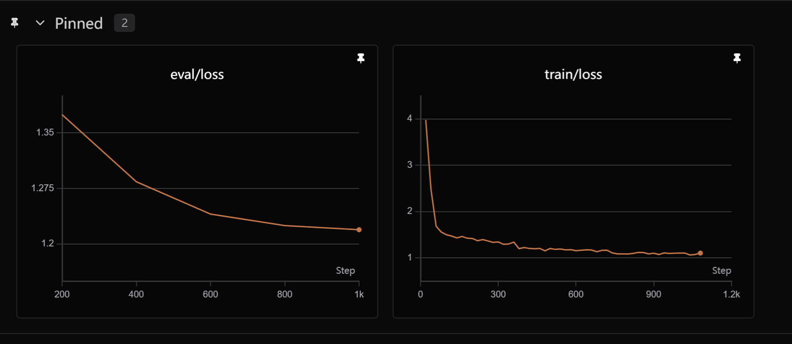
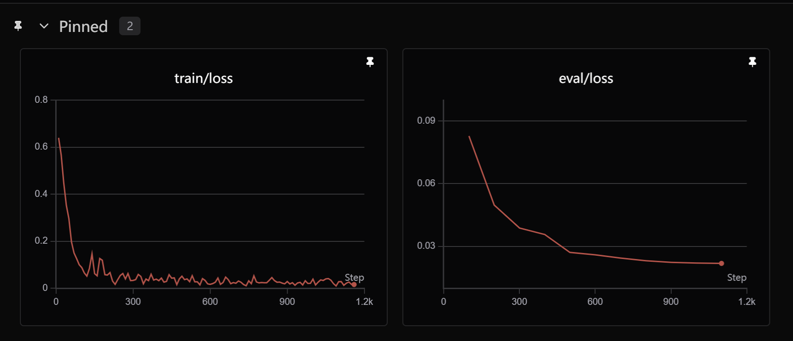
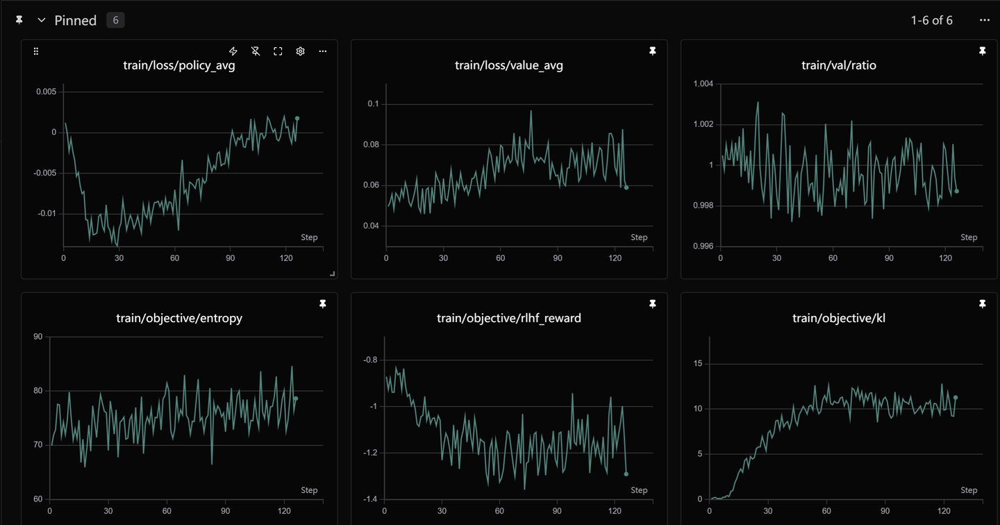
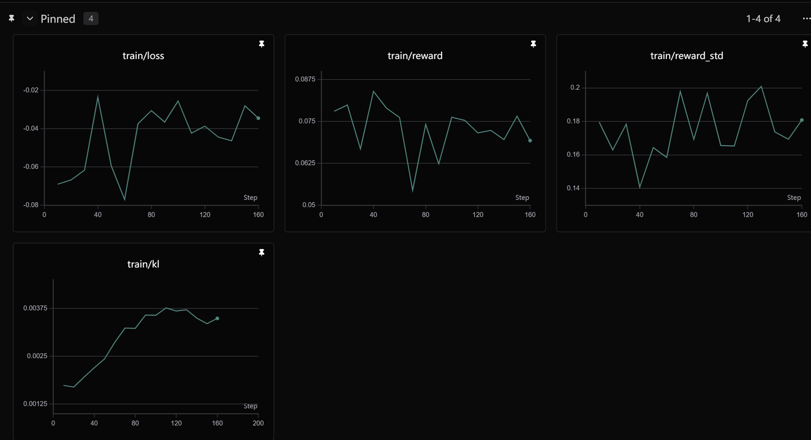
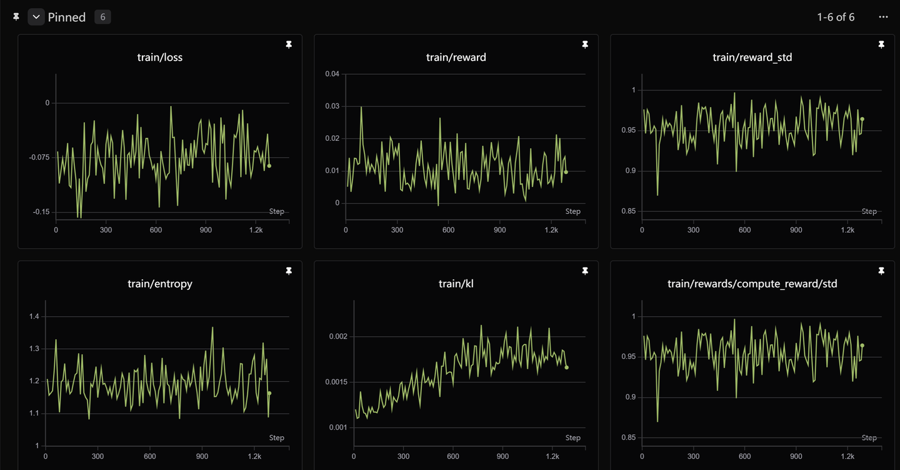
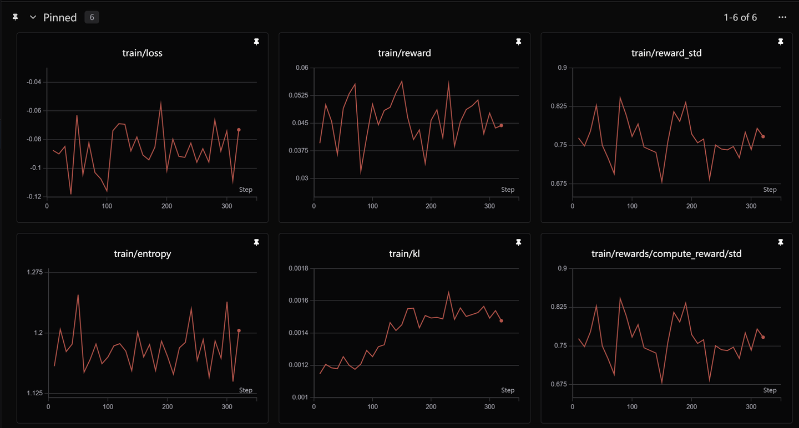
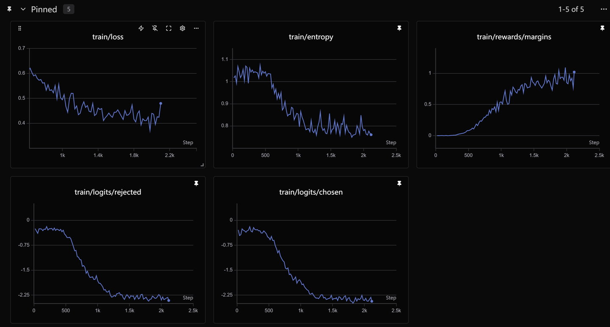
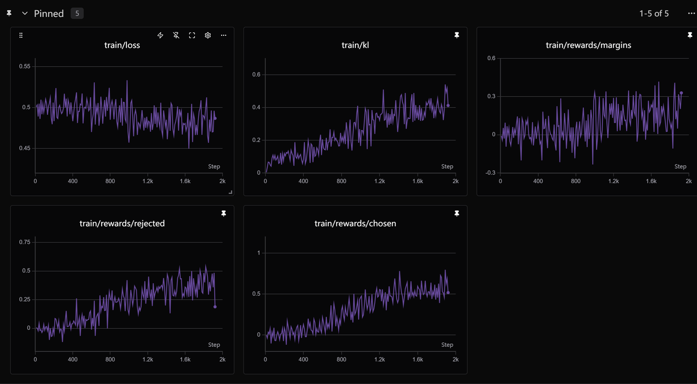

## 🔬 多轮对话六种对齐算法效果对比

本文旨在分享本人用 RLHF 训练一个电影知识多轮对话模型中遇到的一些问题：
- 多轮对话 Reward Model 的设计难点
- 带有 RM 的对齐算法（PPO、GRPO、DAPO、GSPO）训练不稳定的原因分析
- 不带 RM 的对齐算法（DPO、KTO）训练稳定，但存在对话风格与数据集保持一致、事实一致性错误等问题
- Reward Model 难以构建的根本原因探讨
- 知乎链接：[www.zhihu.com](https://zhuanlan.zhihu.com/p/2024850929963345518)

### 训练曲线

| 算法 | Loss 曲线 |
|:---:|:---:|
| **SFT** |  |
| **Reward Model** |  |
| **PPO** |  |
| **GRPO** |  |
| **DAPO** |  |
| **GSPO** |  |
| **DPO** |  |
| **KTO** |  |

> 从曲线可以看出：**DPO 和 KTO 训练过程最平稳**，而带有 Reward Model 的 PPO 系列算法普遍存在训练震荡问题。

---

## 基础模型
`Qwen3-1.7B`

---

##  快速开始

### 安装环境
```bash
pip install -r requirements.txt
```

### 执行的时候使用SFT、RM、RL文件下的main方法
```bash
python main.py
